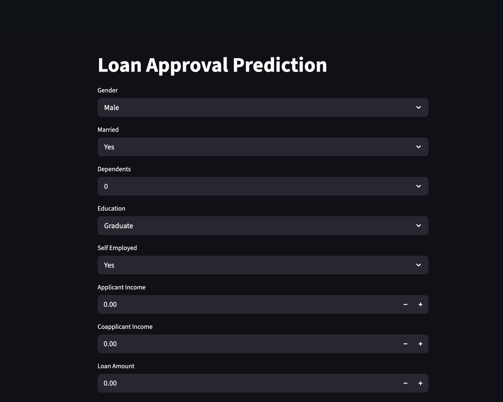

# 📊 Loan Approval Prediction System


---

## 🚀 Live Demo

The project is deployed using Streamlit and is accessible here:

👉 https://loan-approval-system-43quagetfp79mm7gnqrv9q.streamlit.app/

### 📌 How it works:
- User enters applicant details (income, credit history, employment, etc.)
- Machine Learning model processes the input
- System predicts **Loan Approved / Not Approved** instantly

---

## 🖼️ Screenshots

### 🔹 Home Page


## 🧠 Overview

This project is an end-to-end Machine Learning system that predicts loan approval status based on applicant data.

It demonstrates a complete ML lifecycle:
- Data preprocessing
- Feature engineering
- Model training
- Evaluation
- Deployment

---

## 🎯 Problem Statement

Financial institutions need to evaluate loan applications efficiently.  
This system automates the decision-making process using machine learning.

---

## 📂 Dataset

- Source: Kaggle Loan Prediction Dataset  
- Records: 614 applications  
- Features:
  - Applicant Income
  - Coapplicant Income
  - Loan Amount
  - Credit History
  - Property Area
  - Employment details

---

## ⚙️ Tech Stack

- Python 🐍  
- Pandas, NumPy  
- Scikit-learn 🤖  
- Streamlit 🌐  
- Joblib  

---

## 🔄 Workflow

### 1. Data Preprocessing
- Missing value imputation (mean/mode)
- Categorical encoding (one-hot encoding)
- Dropped irrelevant columns (Loan_ID)

### 2. Exploratory Data Analysis
- Credit history found as strongest predictor
- Income showed moderate impact
- Dataset showed class imbalance

### 3. Model Building
- Logistic Regression (Final Model)
- Random Forest (Comparison Model)

### 4. Evaluation
- Accuracy: ~83%
- Better performance on approved loans
- Identified class imbalance issue

---

## 📈 Key Insights

- Credit History is the most influential feature
- Income alone is not a strong predictor
- Model is slightly biased toward approvals due to dataset imbalance

---

## 🧪 How to Run Locally

```bash id="runlocal1"
git clone <your-repo-link>
cd loan-approval-system

pip install -r requirements.txt

streamlit run app.py

loan-approval-system/
│
├── app.py
├── src/
│   ├── preprocess.py
│   ├── train.py
│   └── predict.py
│
├── model/
│   ├── loan_model.pkl
│   ├── scaler.pkl
│   └── features.pkl
│
├── data/
│   ├── train.csv
│   └── test.csv
│
├── requirements.txt
└── README.md
